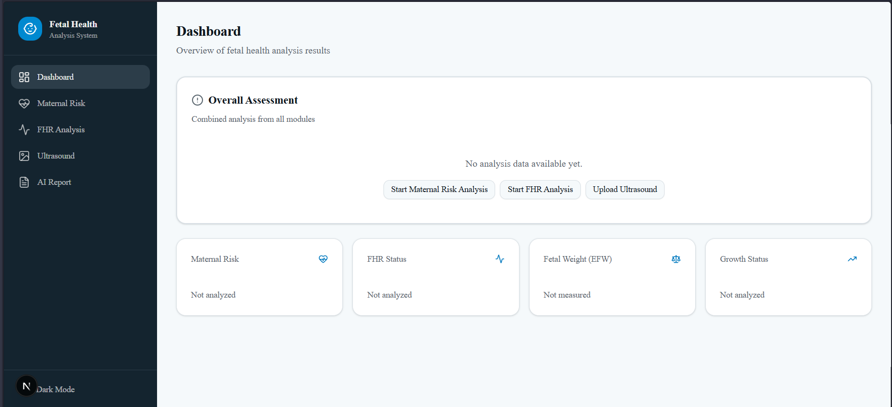
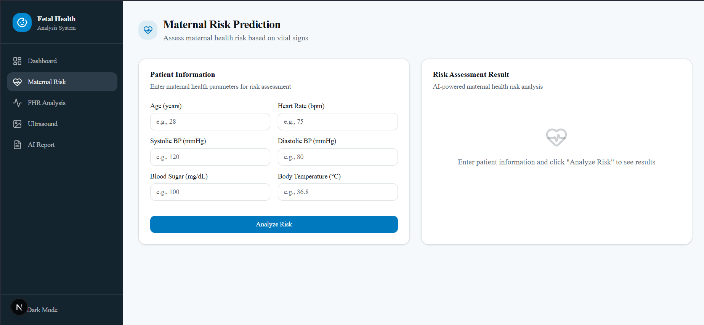
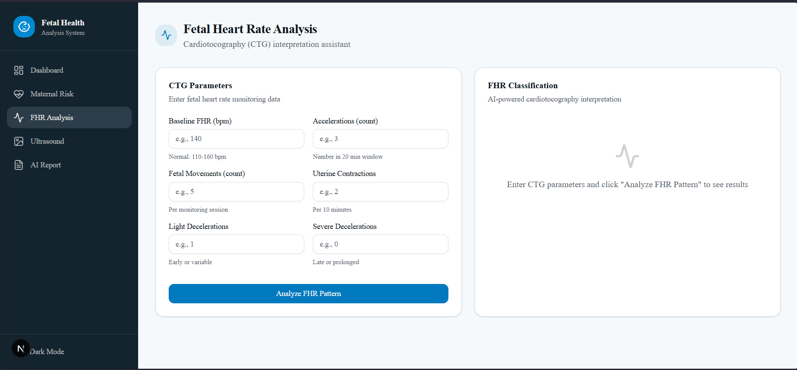
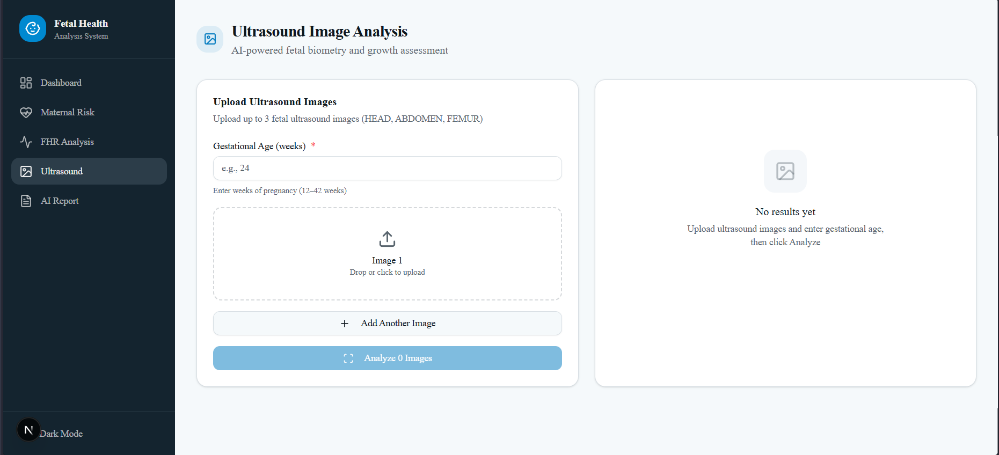
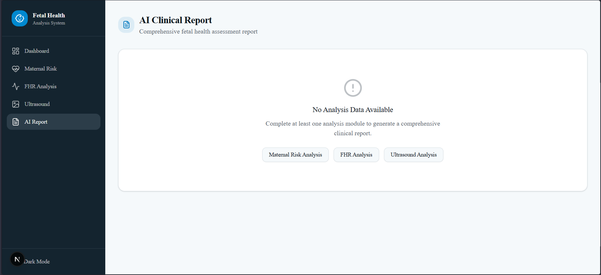

#  Fetal Health Analysis using Machine Learning & Deep Learning

An end-to-end healthcare AI platform that combines machine learning, deep learning, computer vision, and full-stack web development to assist in maternal and fetal health assessment.

The system analyzes clinical data, fetal cardiotocography (CTG) records, and ultrasound images to provide risk predictions, fetal health classification, anatomical plane detection, and medical image segmentation through a unified web interface.

---

##  Project Highlights

* Full-stack healthcare AI platform built with **Next.js, TypeScript, FastAPI, and Python**
* **4 independent ML/DL pipelines** integrated into a single clinical dashboard
* **Maternal Risk Prediction** using XGBoost
* **CTG Fetal Health Classification** using Artificial Neural Networks (ANN)
* **Ultrasound Plane Classification** using ResNet50 with Grad-CAM explainability
* **Fetal Head and Abdomen Segmentation** using U-Net
* Modular FastAPI services for real-time model inference

---

##  Problem Statement

Prenatal healthcare often requires the interpretation of multiple clinical data sources including maternal vitals, fetal heart monitoring records, and ultrasound scans.

This project provides an intelligent decision-support platform capable of:

* Predicting maternal health risk
* Classifying fetal health states
* Detecting fetal anatomical planes from ultrasound scans
* Segmenting fetal anatomical structures
* Delivering results through a modern web-based interface

---

##  Demo

### Dashboard

> Overview of fetal health analysis results with combined assessment from all modules.

### Maternal Risk Prediction

> Input maternal vitals (Age, BP, Blood Sugar, Heart Rate, Body Temperature) for AI-powered risk classification.

### Fetal Heart Rate (CTG) Analysis

> Enter CTG parameters like Baseline FHR, Accelerations, Decelerations to classify fetal health status.

### Ultrasound Image Analysis

> Upload fetal ultrasound images (Head, Abdomen, Femur) for plane classification and biometry.

### AI Clinical Report

> Comprehensive AI-generated clinical report combining results from all analysis modules.

---

##  System Architecture

```
Frontend (Next.js + TypeScript)
          ↓
    FastAPI Backend
          ↓
  ML / DL Inference Services
  ├── Maternal Risk (XGBoost)
  ├── CTG Analysis (ANN)
  ├── Ultrasound Classification (ResNet50)
  ├── Head Segmentation (U-Net)
  └── Abdomen Segmentation (U-Net)
          ↓
    Prediction Results
          ↓
  Interactive Clinical Dashboard
```

---

##  Model Performance

| Pipeline | Model | Performance |
|---|---|---|
| Maternal Risk Prediction | XGBoost | 81.77% Test Accuracy |
| CTG Fetal Health Analysis | ANN | 82.39% Test Accuracy |
| Ultrasound Plane Classification | ResNet50 | 93.0% Accuracy |
| Fetal Head & Abdomen Segmentation | U-Net | 95.9% IoU |
| Fetal Head & Abdomen Segmentation | U-Net | 97.9% Dice Score |

---

##  Machine Learning Pipelines

### 1. Maternal Health Risk Prediction

**Objective:** Predict maternal health risk levels using clinical measurements.

**Input Features:** Age, Systolic BP, Diastolic BP, Blood Glucose, Body Temperature, Heart Rate

**Model:** XGBoost Classifier

**Output:** Low Risk / Medium Risk / High Risk

---

### 2. CTG Fetal Health Classification

**Objective:** Classify fetal health status from cardiotocography (CTG) measurements.

**Model:** Artificial Neural Network (ANN)

**Output Classes:** Normal / Suspect / Pathological

---

### 3. Ultrasound Anatomical Plane Classification

**Objective:** Identify fetal anatomical planes from ultrasound images.

**Model:** ResNet50 (Transfer Learning)

**Explainability:** Grad-CAM visualization

**Supported Planes:** Head / Abdomen / Femur / Other Fetal Planes

---

### 4. Fetal Head Segmentation

**Objective:** Generate pixel-level segmentation masks of fetal head regions.

**Model:** U-Net

**Applications:** Head circumference estimation, Growth monitoring

---

### 5. Fetal Abdomen Segmentation

**Objective:** Segment fetal abdominal structures from ultrasound scans.

**Model:** U-Net

**Applications:** Abdominal circumference estimation, Growth assessment

---

##  Tech Stack

| Layer | Technologies |
|---|---|
| Frontend | Next.js, TypeScript, React, Tailwind CSS |
| Backend | FastAPI, Python |
| Machine Learning | XGBoost, Scikit-Learn |
| Deep Learning | TensorFlow / Keras, PyTorch |
| Computer Vision | OpenCV, Grad-CAM |
| Data Processing | NumPy, Pandas |

---

##  Project Structure

```
FETAL-HEALTH/
│
├── Backend/
│   ├── main.py
│   └── services/
│       ├── maternal.py
│       ├── fhr.py
│       ├── classify.py
│       ├── head.py
│       ├── abdomen.py
│       ├── femur.py
│       └── hadlock.py
│
├── FRONTEND/
│   ├── app/
│   ├── components/
│   ├── hooks/
│   ├── lib/
│   └── styles/
│
├── Models/
│   ├── best_model.pkl
│   ├── fetal_health_ann_model.h5
│   ├── resnet50_fetal_planes.pth
│   ├── head.pth
│   └── unet_abdomen.pth
│
├── Notebooks/
│   ├── MHRP_XGBoost.ipynb
│   ├── FetalHealthrate.ipynb
│   ├── UltrasoundImage+femur.ipynb
│   └── Head&Abdomen.ipynb
│
├── demo/
│   ├── dashboard.png
│   ├── maternal_risk.png
│   ├── fhr_analysis.png
│   ├── ultrasound.png
│   └── ai_report.png
│
└── README.md
```

---

##  Technical Challenges

* Handling heterogeneous healthcare datasets
* Training multiple ML/DL models under a unified workflow
* Managing ultrasound image preprocessing
* Integrating segmentation and classification pipelines
* Building reusable FastAPI inference services
* Deploying multiple model types within a single application

---

##  Future Enhancements

* RAG-powered AI Clinical Assistant
* Medical guideline retrieval using Vector Databases
* LangChain-based conversational interface
* DICOM image support
* Gestational age estimation
* Cloud deployment using Docker and Kubernetes
* Hospital integration via HL7/FHIR standards

---

## 📜 License

This project is released under the MIT License.
