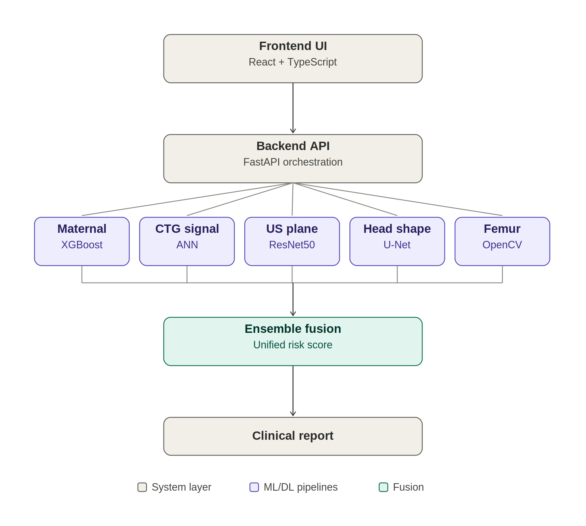

<div align="center">

#  Fetal Health Analysis Platform
### AI-Powered Clinical Decision Support for Maternal & Fetal Health

*A full-stack healthcare AI system combining machine learning, deep learning, computer vision, and modern web engineering to support prenatal risk assessment.*

[](#tech-stack)
[](#tech-stack)
[](#tech-stack)
[](#tech-stack)
[](#license)

[Demo Video](https://drive.google.com/file/d/1tDOiBD4-HCEmggOax7Q0tDK33VmeIyC7/view?usp=drive_link) · [Features](#-project-highlights) · [Architecture](#-system-architecture) · [Pipelines](#-machine-learning--deep-learning-pipelines) · [Tech Stack](#-tech-stack)

</div>

---

##  Overview

Prenatal care depends on interpreting several independent data sources — maternal vitals, fetal heart-rate monitoring, and ultrasound imaging — often across disconnected tools. **This platform unifies all three into a single clinical dashboard**, using four purpose-built ML/DL models to turn raw clinical data into actionable, real-time risk assessments.

Built end-to-end (data pipeline → model training → inference services → production UI), the project demonstrates the full lifecycle of applied AI: from a Kaggle-grade research notebook to a deployable, API-driven web application.

> Originally developed as a capstone project — rated **9.1/10** — and since refined with corrected data pipelines, class-imbalance handling, and clinical-report generation.

---

##  Project Highlights

- **Full-stack healthcare AI platform** — Next.js + TypeScript frontend, FastAPI + Python backend
- **4 independent ML/DL pipelines** unified into one clinical dashboard
- **Maternal Risk Prediction** — XGBoost classifier on clinical vitals
- **CTG Fetal Health Classification** — custom ANN trained on cardiotocography signals, with deliberate class-imbalance tuning for clinical safety
- **Ultrasound Plane Classification** — ResNet50 (transfer learning) with **Grad-CAM explainability**, so predictions are interpretable, not black-box
- **Fetal Head Segmentation** — U-Net for pixel-level anatomical structure detection
- **Modular FastAPI microservices** for real-time, independently-scalable model inference
- **AI-generated clinical reports** synthesizing outputs from all four pipelines into one summary

---

##  Problem Statement

Prenatal healthcare requires synthesizing multiple, heterogeneous data types — clinical vitals, time-series fetal heart monitoring, and medical imaging — to make timely risk decisions. This platform acts as an intelligent decision-support layer that:

- Predicts maternal health risk from vitals
- Classifies fetal health status from CTG data
- Detects fetal anatomical planes in ultrasound scans
- Segments fetal anatomical structures for biometric measurement
- Delivers every result through a unified, modern web interface

---

##  Demo

| | |
|---|---|
| **Dashboard** — combined assessment across all modules |  |
| **Maternal Risk Prediction** — AI-powered classification from vitals (Age, BP, Blood Sugar, Heart Rate, Body Temp) |  |
| **Fetal Heart Rate (CTG) Analysis** — classify fetal health from Baseline FHR, Accelerations, Decelerations |  |
| **Ultrasound Image Analysis** — upload Head / Abdomen / Femur scans for plane classification & biometry |  |
| **AI Clinical Report** — consolidated report across all modules |  |

 **[Watch the full demo video](https://drive.google.com/file/d/1tDOiBD4-HCEmggOax7Q0tDK33VmeIyC7/view?usp=drive_link)**



---

##  System Architecture

```
                     ┌─────────────────────────────┐
                     │   Frontend (Next.js + TS)   │
                     │   Clinical Dashboard UI     │
                     └──────────────┬──────────────┘
                                    │  REST API
                                    ▼
                     ┌─────────────────────────────┐
                     │      FastAPI Backend        │
                     │   Request routing & I/O     │
                     └──────────────┬──────────────┘
                                    │
              ┌─────────────────────┼─────────────────────┐
              ▼                     ▼                     ▼
   ┌────────────────────┐ ┌────────────────────┐  ┌────────────────────┐
   │  Maternal Risk     │ │  CTG Analysis      │  │  Ultrasound        │
   │  (XGBoost)         │ │  (ANN)             │  │  Classification    │
   │                    │ │                    │  | (ResNet50+Grad-CAM)│
   └────────────────────┘ └────────────────────┘  └──────────┬──────────┘
                                                             ▼
                                                   ┌────────────────────┐
                                                   │  Head Segmentation  │
                                                   │  (U-Net)            │
                                                   └──────────┬──────────┘
                                                              ▼
                                              ┌───────────────────────────┐
                                              │  Aggregated Predictions   │
                                              │  → Interactive Dashboard  │
                                              │  → AI Clinical Report     │
                                              └───────────────────────────┘
```

---

##  Model Performance

| Pipeline | Model | Metric | Result |
|---|---|---|---|
| Maternal Risk Prediction | XGBoost | Test Accuracy | **81.77%** |
| CTG Fetal Health Classification | ANN | Test Accuracy | **~80%** (macro F1: 0.632) |
| Ultrasound Plane Classification | ResNet50 | Accuracy | **93.0%** |
| Fetal Head Segmentation | U-Net | IoU | **95.66%** |

> **Engineering note:** the CTG/ANN model's raw accuracy peaked higher, but the initial version recognized only **5.71%** of true Pathological cases — an unacceptable miss rate for a clinical-safety-critical class. Iterative `class_weight` tuning traded a small amount of overall accuracy for a **7× improvement in Pathological recall (5.71% → 40%)**, prioritizing the metric that actually matters in this domain: not missing high-risk cases.

---

##  Machine Learning & Deep Learning Pipelines

### 1. Maternal Health Risk Prediction
**Objective:** Predict maternal health risk level from clinical vitals.
**Input Features:** Age, Systolic BP, Diastolic BP, Blood Glucose, Body Temperature, Heart Rate
**Model:** XGBoost Classifier
**Output:** Low Risk / Medium Risk / High Risk

### 2. CTG Fetal Health Classification
**Objective:** Classify fetal health status from cardiotocography (CTG) measurements.
**Model:** Artificial Neural Network (ANN), tuned for class-imbalance-aware recall on the clinically critical minority class.
**Output Classes:** Normal / Suspect / Pathological

### 3. Ultrasound Anatomical Plane Classification
**Objective:** Identify fetal anatomical planes from ultrasound images.
**Model:** ResNet50 (Transfer Learning)
**Explainability:** Grad-CAM visualization highlights the image regions driving each prediction
**Supported Planes:** Head / Abdomen / Femur / Other Fetal Planes

### 4. Fetal Head Segmentation
**Objective:** Generate pixel-level segmentation masks of fetal head regions.
**Model:** U-Net
**Applications:** Head circumference estimation, growth monitoring

---

## 🛠️ Tech Stack

| Layer | Technologies |
|---|---|
| Frontend | Next.js, TypeScript, React, Tailwind CSS |
| Backend | FastAPI, Python |
| Machine Learning | XGBoost, Scikit-Learn |
| Deep Learning | TensorFlow / Keras, PyTorch |
| Computer Vision | OpenCV, Grad-CAM |
| Data Processing | NumPy, Pandas |

---

##  Project Structure

```
FETAL-HEALTH/
│
├── Backend/
│   ├── main.py
│   └── services/
│       ├── maternal.py
│       ├── fhr.py
│       ├── classify.py
│       ├── head.py
│       ├── femur.py
│       └── hadlock.py
│
├── FRONTEND/
│   ├── app/
│   ├── components/
│   ├── hooks/
│   ├── lib/
│   └── styles/
│
├── Models/
│   ├── best_model.pkl
│   ├── fetal_health_ann_model.h5
│   ├── resnet50_fetal_planes.pth
│   └── head.pth
│
├── Notebooks/
│   ├── MHRP_XGBoost.ipynb
│   ├── FetalHealthrate.ipynb
│   ├── UltrasoundImage+femur.ipynb
│   └── Head.ipynb
│
├── demo/
│   ├── dashboard.png
│   ├── maternal_risk.png
│   ├── fhr_analysis.png
│   ├── ultrasound.png
│   └── ai_report.png
│
└── README.md
```

---

##  Technical Challenges & Solutions

| Challenge | How it was addressed |
|---|---|
| Heterogeneous healthcare datasets (tabular + time-series + image) | Built separate, purpose-fit pipelines per modality instead of forcing one model architecture |
| Multiple ML/DL model types in one workflow | Standardized on modular FastAPI inference services, each independently deployable |
| Severe class imbalance in CTG data (Pathological cases rare) | Iteratively tuned `class_weight` strategies to prioritize recall on the clinically critical class over raw accuracy |
| Ultrasound image preprocessing at scale | OpenCV-based preprocessing pipeline feeding a ResNet50 transfer-learning model |
| Model interpretability for clinical trust | Integrated Grad-CAM so predictions are visually explainable, not black-box |
| Integrating segmentation + classification pipelines | Unified output schema so the frontend renders both under one dashboard |

---

##  Future Enhancements

- RAG-powered AI Clinical Assistant for guideline-grounded Q&A
- Medical guideline retrieval using vector databases
- LangChain-based conversational interface
- DICOM image support
- Gestational age estimation
- Cloud deployment via Docker + Kubernetes
- Hospital system integration via HL7/FHIR standards

---

##  License

Released under the [MIT License](LICENSE).

---

<div align="center">

**Built to demonstrate end-to-end applied AI engineering — from raw clinical data to a production-ready clinical dashboard.**

</div>
